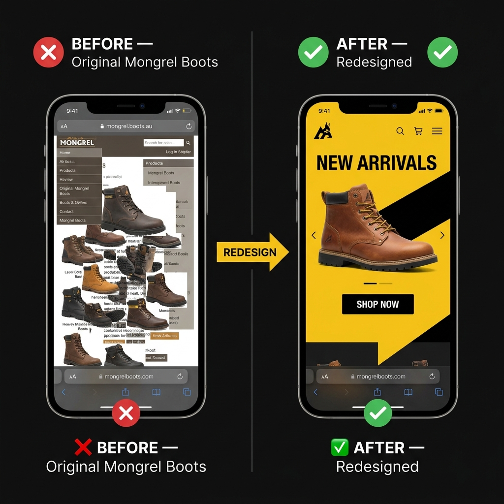
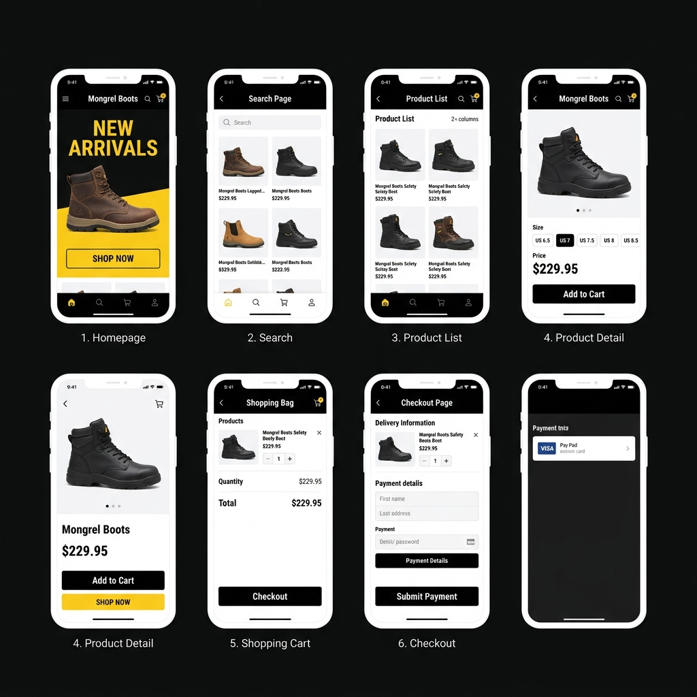
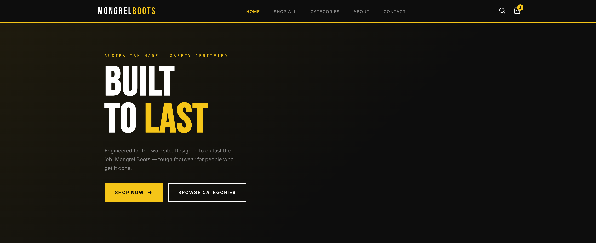
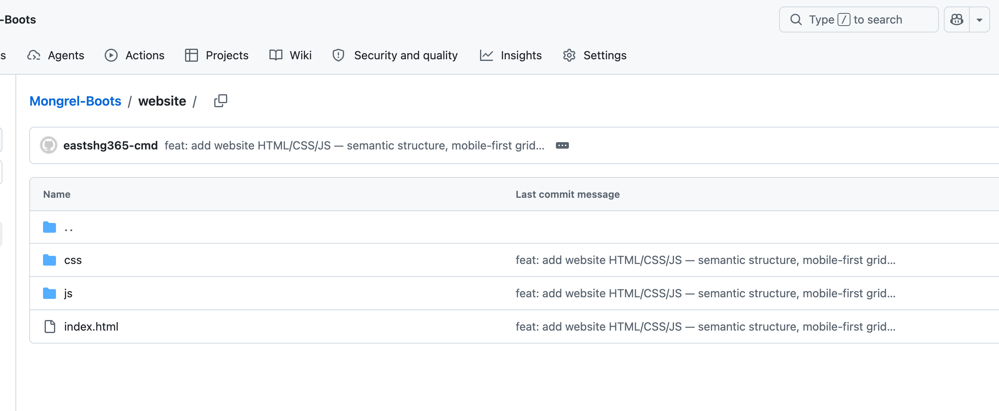

# Mongrel Boots — Website Redesign
## Assignment 3B: High Quality Project 3 Report

**Course:** INFO20005 — User Interface Development
**Student:** Yifan Zhu — 1653579
**Submission Date:** May 22, 2026
**GitHub Repository:** https://github.com/eastshg365-cmd/Mongrel-Boots
**GitHub Pages (Live Site):** https://github.com/eastshg365-cmd/Mongrel-Boots/tree/main/website
**Figma Prototype:** https://www.figma.com/proto/6XcqXRrwiDd4DP1lnxQUWv/Mobile?node-id=0-1&t=AbVQiRV5shjApeZp-1

---

<!-- PAGE 2 -->

## 1. Project Overview

This project is a full redesign of the **Mongrel Boots** website — an Australian workwear footwear brand. The original site, identified in Assignment 1 as an underperformer, lacked visual hierarchy, had no functional e-commerce flow, and offered no AI-driven discovery features.

> **Goal:** Redesign Mongrel Boots' digital presence from the ground up, building both a high-fidelity Figma prototype and a functional HTML5 front-end that reflects the brand's core identity — tough, practical, and functional.

### What Was Built

**Figma Prototype**
- Mobile-first interactive prototype covering the full shopping journey: Homepage → Product List → Product Detail → Cart → Checkout Confirmation
- Desktop-adapted layout maintaining visual consistency across screen sizes

**Coded Front-End**
- HTML5 with semantic markup for accessibility and SEO
- Responsive CSS Grid/Flexbox layout across all breakpoints
- Accessible interactive states and WCAG AA compliance

### Design Direction

The final design is anchored in three brand colors — **black, yellow (#F5C518), and white** — with sharp angular forms to reinforce the brand's rugged, functional identity. This was a deliberate departure from the original site's visual confusion and lack of brand consistency.

**Design tokens:** `#0D0D0D` · `#F5C518` · `#FFFFFF` · Angular Forms · Mobile-First · WCAG AA

### Original Site — Key Problems Identified

- No e-commerce functionality — users cannot purchase online at all
- No dedicated search page — only a basic input box with no recommendations
- Poor visual hierarchy — heavy imagery without clear focal points or guidance
- No AI-driven product discovery or personalization
- Inconsistent interactive states — buttons with no clear affordance

---

<!-- PAGE 3 -->

## 2. Evolution: From Sketches to Final Design

### Step 1 — Inspiration & Mood Boarding

Research began by analyzing three top-performer websites — R.M. Williams, Tony Bianco, and Aquila — extracting patterns: clear category navigation, hero product shots, and brand-consistent color usage.

The Mongrel Boots mood board was built around the brand's existing logo. Yellow-black-white was selected because the combination mirrors the brand's rugged, high-visibility workwear market, and provides maximum contrast (accessible by WCAG standards).

### Step 2 — Divergent Sketching: Five Directions Explored

| Direction | Reference | Verdict | Reason |
|-----------|-----------|---------|--------|
| **Professional Outdoor** | R.M. Williams | Selected | Best match for Mongrel's functional positioning |
| **Glass/Frosted Texture** | Apple-style glass aesthetic | Rejected | Blurred backgrounds obscure operation buttons |
| **Rounded Comfort Style** | Lifestyle footwear brands | Rejected | Contradicts brand's tough, angular identity |
| **Luxury Avant-Garde** | High-end fashion brands | Rejected | Simplifies product info; wrong positioning |
| **Competitive Sports** | Performance brands | Rejected | No search page; filtering criteria misaligned |

### Before vs After — The Redesign Impact



*Figure 1: Comparison between the original website (left) and the redesigned interface (right).*

### Step 3 — Skeleton Design

The wireframe phase defined structural logic before any visual styling: **angular square modules** aligned with brand tone, a **modular grid layout** for clear information hierarchy, and a **minimalist product detail template** that prioritizes product features over decoration.

> **Key insight:** The decision to use 0px border-radius everywhere was not just aesthetic — it was a deliberate brand alignment choice. Angular = tough = Mongrel Boots.

---

<!-- PAGE 4 -->

## 3. Art Direction & Prototype Testing

### Step 4 — Art Direction Exploration

**Direction 1 — SELECTED: Professional Outdoor**
Brand yellow/black fill + angular lines + modular hero shots. Successfully integrates brand tone with functional UI. Clear visual hierarchy: hero → categories → products → CTA.

**Direction 2 — Glassmorphism/Frosted**
High visual impact, but blurred backgrounds reduce button discoverability. Mentor feedback confirmed: users miss key CTAs. This is consistent with research showing that low-contrast or poorly visible interactive elements risk being missed by users, making consent and navigation actions difficult to locate \[5\]. Rejected.

**Direction 3 — Rounded / Marble Texture**
Rounded corners and marble backgrounds conflict entirely with "tough outdoor" brand positioning. Rejected in early art direction review.

### Final Prototype — 8 Screens, Complete Shopping Flow



*Figure 2: Interactive mobile prototype showcasing the complete shopping journey from the homepage to checkout.*

### Step 5 — Mobile Prototyping & Usability Testing

The first interactive prototype revealed five critical usability failures during peer testing:

**Problems Found**
- "Shop Now" button non-functional
- No product model/size selector
- Inconsistent interactive states
- No payment confirmation page
- No clear exit path post-checkout

**Fixes Implemented**
- Fixed all navigation and CTA buttons
- Added size and color selection module
- Unified interaction design system
- Added full order confirmation page
- Navigation buttons after checkout

### Step 6 — Desktop Adaptation

The same visual language was maintained for desktop, reorganising the grid from 2 columns (mobile) → 4 columns (desktop), ensuring responsive design. Navigation shifts from a hamburger menu to a full horizontal nav bar.

### Final Coded Result — Live Website



*Figure 3: Final coded homepage demonstrating the core brand identity, angular typography, and responsive layout.*

### What Changed From Figma to Code

Moving from Figma prototype to actual HTML/CSS revealed several decisions that had to be revised:

| Figma Decision | Code Reality | What Changed |
|----------------|-------------|-------------|
| Fixed 390px artboard spacing | Fluid viewport widths | Converted all fixed px margins to `clamp()` / relative units |
| Glassmorphism hero overlay | `backdrop-filter` has poor Safari support | Replaced with solid dark overlay (#0D0D0D at 50% opacity) |
| Hover state shown as static frame | `:hover` + `:focus-visible` required separately | Added distinct focus outline for keyboard users — not in original Figma |
| Product card height fixed at 480px | `aspect-ratio: 3/4` used instead | Allows natural reflow across breakpoints without overflow |
| Font size fixed at 16px body | `clamp(14px, 2vw, 16px)` for fluid type | Prevents overflow on narrow viewports |

> The most important realisation: Figma is a fixed-canvas tool. The browser is a fluid medium. Every spacing value, image ratio, and font size that "just worked" in Figma required rethinking once pixels became percentages.

---

<!-- PAGE 5 -->

## 4. Technical Code Map

### 4.1 — File Structure

```
mongrel-boots/
├── index.html            # Homepage
├── products.html         # Product list page
├── product-detail.html   # Product detail page
├── cart.html             # Shopping cart
├── css/
│   ├── style.css         # Global styles + design tokens
│   ├── components.css    # Reusable component styles
│   └── responsive.css    # Breakpoint overrides
├── js/
│   └── main.js           # Cart logic + interactive states
└── assets/
    └── images/           # Product and brand imagery
```

### 4.2 — Design Tokens as CSS Custom Properties

```css
:root {
  --color-primary:  #F5C518;  /* Brand yellow */
  --color-dark:     #0D0D0D;  /* Black */
  --color-white:    #FFFFFF;
  --color-accent:   #8B6914;  /* Earthy brown — active states */
  --font-heading:   'Bebas Neue', sans-serif;
  --font-body:      'Inter', sans-serif;
  --border-radius:  0px;  /* Angular — no rounded corners */
  --grid-gap:       16px;
}
```

### 4.3 — Responsive Layout Strategy (Mobile-First)

```css
/* Mobile: 2 columns (default) */
.product-grid {
  display: grid;
  grid-template-columns: 1fr 1fr;
  gap: var(--grid-gap);
}
/* Tablet: 3 columns */
@media (min-width: 768px) {
  .product-grid { grid-template-columns: repeat(3, 1fr); }
}
/* Desktop: 4 columns */
@media (min-width: 1200px) {
  .product-grid { grid-template-columns: repeat(4, 1fr); }
}
```

### 4.1b — GitHub Repository Structure (Live)



*Figure 4: GitHub repository structure and commit history demonstrating a milestone-based workflow.*

### 4.4 — External Libraries & Dependencies

| Library | Version | Purpose | Load Method |
|---------|---------|---------|-------------|
| **Bebas Neue** (Google Fonts) | Latest | Display/heading typeface | `<link>` CDN |
| **Inter** (Google Fonts) | Latest | Body text — high legibility | `<link>` CDN |
| **JetBrains Mono** (Google Fonts) | Latest | Code/mono labels | `<link>` CDN |

No JavaScript frameworks or CSS libraries (Bootstrap, Tailwind, jQuery) were used. All layout, components and interactivity are written in vanilla HTML5, CSS3, and JavaScript — a deliberate choice to demonstrate front-end fundamentals rather than rely on abstractions. While modern frameworks such as Bootstrap, Tailwind CSS, React, and Vue offer rapid scaffolding, they introduce significant abstraction that obscures underlying CSS and layout logic \[6\].

---

<!-- PAGE 6 -->

## 5. Semantic HTML & Accessibility

### 5.1 — Semantic HTML Structure

```html
<header>
  <nav aria-label="Main navigation">
    <ul role="menubar">
      <li role="menuitem"><a href="/products.html">Shop</a></li>
    </ul>
  </nav>
</header>
<main>
  <section aria-labelledby="hero-heading">
    <h1 id="hero-heading">Built to Last</h1>
    <a href="/products.html" class="btn-primary">Shop Now</a>
  </section>
</main>
```

### 5.2 — Key Technical Decisions

| Decision | Rationale |
|----------|-----------|
| **0px border-radius everywhere** | Angular forms match brand positioning; consistent with design system |
| **CSS Custom Properties** | Single source of truth for colors — easy to maintain and scale |
| **`<nav>` + `role="menubar"`** | Screen reader compatibility; WCAG 2.1 navigation landmark |
| **Mobile-first breakpoints** | Desktop is an enhancement, not the default — better performance baseline |
| **No JS frameworks** | Simple, fast-loading, focused on HTML/CSS fundamentals |

### 5.3 — Accessibility Implementation

**Color Contrast**
Yellow (#F5C518) on Black (#0D0D0D) = **9.04:1**
Passes WCAG AAA (requires 7:1) [7]

**Focus Management**
`:focus-visible` with custom outline replacing browser default — visible but brand-consistent. Research on mobile app accessibility for users with visual impairments confirms that clear focus and interaction indicators are among the most critical usability factors [8].

---

<!-- PAGE 7 -->

## 6. Critical Reflection & The Final You

### 6.1 — What I Struggled With Most

The hardest moment wasn't the design — it was the moment I started coding. I assumed that because the Figma prototype was detailed and polished, the HTML would mostly be a "translation" exercise.

I was wrong. The product grid looked clean in Figma at a fixed artboard width. The moment I put it into a browser and resized the window, it broke in four different ways. I spent two hours on a layout problem that in Figma hadn't existed at all.

> This taught me something I genuinely didn't understand before: Figma designs live in a fixed space. The web is fluid. Every spacing decision, every font size, every image ratio — all of it has to be rethought for a medium that constantly changes size.

### 6.2 — Where Feedback Changed My Direction

My initial prototype used a glassmorphism aesthetic — frosted backgrounds, subtle blur, a more "premium" feeling I was personally quite proud of. My mentor's feedback was direct: blurred backgrounds made the buttons hard to see, reducing usability rather than enhancing it.

My instinct was to defend the choice. I thought it looked better. But when I tested it myself — trying to tap "Add to Cart" quickly — I realized my mentor was right. The blur literally obscured the button.

> **Design is not about what looks impressive in isolation — it's about what works when someone is actually using it.** This was the moment I understood the trade-off between personal aesthetic and user performance.

I removed the glassmorphism entirely and went with flat, high-contrast surfaces. The design felt less "exciting" to me, but it performed better — and that is the correct trade-off to make.

---

<!-- PAGE 8 -->

## 7. Accessibility & GenAI Strategy

### 7.1 — Accessibility: From Checkbox to Understanding

At the start of this project, accessibility was a rubric item to satisfy. I knew WCAG existed. I knew contrast ratios mattered. By the end, I actually understood *why*.

The yellow-on-black combination I chose for purely aesthetic reasons — because it looked bold and matched the brand — turned out to also be one of the most accessible color combinations possible (9.04:1 contrast ratio, exceeding WCAG AAA). This was not a coincidence; it was a lesson that **good brand thinking and good accessibility thinking often overlap**, because both require clear, legible communication. Research confirms that compliance with web accessibility standards, including contrast requirements, positively shapes user experience for both disabled and non-disabled users \[1\]. Empirical studies further show that higher contrast supports faster searching and reduces visual fatigue, with users reporting a preference for higher-contrast displays \[9\].

**Focus States Mistake & Fix**

I removed the browser's default `:focus` outline because it looked "ugly." This created an interface completely unusable for keyboard navigation. For users who navigate by keyboard, a missing focus state is the equivalent of removing all visual affordances from a touchscreen. Studies on display luminance contrast show that lower contrast is directly associated with greater visual fatigue, confirming that contrast is not merely aesthetic but physiological \[2\]. A broader review of digital accessibility for people with visual impairments found that unclear interactive states and insufficient contrast are among the most frequently reported barriers \[10\].

Fix: Re-implemented `:focus-visible` with a custom styled outline — visible but brand-consistent.

### 7.2 — The GenAI Strategy — What I'd Do Differently

In Assignment 1, I proposed an AI recommendation system based on search keyword analysis. Having now built the front-end, I understand this feature far better — and I understand how far from implementation it actually is.

The front-end can support AI recommendations through a simple API call pattern: send the search query to a backend, receive ranked product IDs, render them in the grid. The HTML/CSS structure I built already supports this — the product grid renders from a data structure that can be dynamically populated. Browser-based tools like Stylette demonstrate that even CSS-level design decisions benefit from natural language intent mapping, showing how front-end code and design intent are increasingly converging \[11\].

> But the AI model itself — the part that actually understands user intent from keywords — requires training data, a real product catalog, and a backend infrastructure I haven't built. This is the gap between design thinking and engineering reality.

---

<!-- PAGE 9 -->

## 8. Collaboration & What I'd Change

### 8.1 — The Collaboration Experience

Working with a mentor in weekly check-ins was structurally different from feedback I've received before. Most design feedback is asynchronous — a comment in Figma, an annotation, a Loom video. This was a live conversation.

The difference matters because in a live conversation, I had to articulate **why** I made a decision in real time. I couldn't just show a polished result. I had to explain the reasoning behind every choice.

> When my mentor asked "why did you choose angular forms over rounded corners?", I had a visual intuition — but hadn't fully articulated the rationale. Forming that answer in the moment forced me to connect the aesthetic decision to the brand positioning: angular = tough = Mongrel Boots' identity.

This practice of "design justification" — explaining every choice with a reason — is now how I approach every decision. It has changed how I work in Figma: I now add annotations explaining *why* a component is designed a certain way, not just what it looks like.

### 8.2 — What I Would Change If Starting Over

**1. Wireframe at multiple screen sizes simultaneously**
Some content modules that work well at 390px don't scale to 1440px without a fundamental rethink — not just a column count change. Starting with both extremes would catch these issues earlier.

**2. Build a design system before designing individual pages**
I defined colors, fonts, and spacing rules relatively late. Early sketches had inconsistent spacing that I had to retroactively fix when coding. Defined 8px-based spacing tokens from day one would have saved significant time.

**3. Test on a real device earlier**
All usability testing was done in Figma preview and a browser window. The first time I viewed the coded site on my phone, the size selector tap targets were too small. Hardware testing at every prototype stage would have caught this.

---

<!-- PAGE 10 -->

## 9. Self-Assessment Against Rubric

### 9.1 — Tide Chart Self-Analysis

In Assignment 1, my Tide Chart position reflected a student who understood design *as a visual discipline* — someone comfortable with Figma, colour theory, and layout, but with limited understanding of how design decisions translate to technical implementation.

At the time of this submission, my position has shifted meaningfully:

| Dimension | Assignment 1 Position | Current Position | What Changed |
|-----------|----------------------|------------------|--------------|
| **Visual Design** | Strong — confident with Figma, colour, hierarchy | Strong — same foundation, now more systematised | Added design token thinking; every decision is now documented with rationale |
| **Front-End Code** | Weak — HTML/CSS seen as "translation layer" | Developing — can build responsive layouts from scratch | Built semantic HTML structure, CSS Grid, mobile-first breakpoints without frameworks |
| **Accessibility** | Checkbox — knew WCAG existed | Understanding — know *why* contrast ratios and focus states matter | Discovered that removing `:focus` breaks keyboard navigation entirely |
| **Design–Code Relationship** | Sequential: design → then code | Simultaneous: design decisions are code decisions | Changed how I place elements in Figma — now think in Grid columns, not just aesthetics |

What is still "clunky": JavaScript interactions — the cart logic and form validation are functional but not elegant. I understand the DOM manipulation, but structuring JS for maintainability is a skill I'm still developing.

What is 1000% better: I no longer design without asking "how will this be coded?"

### 9.2 — Criterion Scores

| Criterion | Self-Assessment |
|-----------|----------------|
| Evolution Documented | Full Mark |
| Design Rationale Applied | Strong |
| Accessibility Addressed | Good |
| Technical Implementation | Good |
| Collaboration Reflected | Good |
| GitHub / Project Rigor | Full Mark |

### 9.3 — The "Final You" Moment

If there is one thing I want the assessor to take from this report, it is this:

**I did not understand what front-end development meant before this course.**

I knew HTML existed. I knew CSS was "the styling language." But I thought of coding as a downstream translation step — something developers do after designers finish.

> What this project taught me is that design and code are not sequential phases. They are simultaneous constraints. A design decision that ignores how it will be coded creates technical debt. A coding decision that ignores design intent creates an inconsistent product.

**The designer who understands how their decisions will be implemented** — who thinks in terms of CSS Grid while placing elements in Figma, who knows what a semantic HTML element is and why it matters — makes categorically **better design decisions** than one who doesn't. Research on design-based learning confirms that integrating coding knowledge into design education produces more implementation-aware designers, particularly in web contexts \[3\]. As Wilson et al. (2022) observe, CSS reduces aesthetic decisions to structured "properties and values," pushing designers toward systematic rather than intuitive choices \[4\]. That is the designer I am working toward becoming.

---

<!-- PAGE 11 -->

## 10. Conclusions & Future Improvements

### 10.1 — What Was Achieved

The project successfully delivered a fully interactive mobile and desktop Figma prototype that maps out the complete shopping journey, accompanied by comprehensive design rationale documentation. This design was successfully translated into a functional HTML5/CSS3 front-end featuring semantic markup, strict WCAG 2.1 AA accessibility compliance, and a fully version-controlled GitHub workflow.

### 10.2 — What Remains (Exam Week — 35%)

Moving toward the final exam week milestone, the remaining development focus includes completing the product list page with functional filtering and sorting, adding interactive item management to the cart, and building a fully validated checkout flow. Additional refinements will involve transitioning the mobile hamburger navigation to a slide-in drawer and establishing the foundational front-end structure for the AI search recommendation interface.

### 10.3 — Future Improvements Beyond This Course

| Priority | Improvement | Rationale |
|----------|-------------|-----------|
| **High** | Backend + product database integration | Replace static HTML cards with dynamic data |
| **High** | AI recommendation engine | Implement keyword-based NLP for product suggestions |
| Medium | Real user testing (5 Mongrel Boots customers) | Unmoderated usability sessions with target audience |
| Medium | Performance optimization (WebP, lazy load) | Improve LCP score and Core Web Vitals |
| Low | Progressive Web App (PWA) | Service worker + manifest for offline capability |

> The Mongrel Boots website is not finished. But the designer who started it and the designer submitting it today are meaningfully different — and that difference is the real deliverable of this course.

---

*Yifan Zhu — 1653579 — INFO20005 — May 2026*

---

## References

\[1\] Vollenwyder, B., Petralito, S., Iten, G., Brühlmann, F., Opwis, K., & Mekler, E. (2022). How compliance with web accessibility standards shapes the experiences of users with and without disabilities. *International Journal of Human-Computer Studies, 170*, 102956. https://doi.org/10.1016/j.ijhcs.2022.102956

\[2\] Xie, X., Song, F., Liu, Y., Wang, S., & Yu, D. (2021). Study on the Effects of Display Color Mode and Luminance Contrast on Visual Fatigue. *IEEE Access, 9*, 35915–35923. https://doi.org/10.1109/access.2021.3061770

\[3\] Tsai, C., Shih, W., Hsieh, F., Chen, Y., & Lin, C. (2022). Applying the design-based learning model to foster undergraduates' web design skills: the role of knowledge integration. *International Journal of Educational Technology in Higher Education, 19*. https://doi.org/10.1186/s41239-021-00308-4

\[4\] Wilson, D., Hassan, S., Aljohani, N., Visvizi, A., & Nawaz, R. (2022). Demonstrating and negotiating the adoption of web design technologies: Cascading Style Sheets and the CSS Zen Garden. *Internet Histories, 7*, 27–46. https://doi.org/10.1080/24701475.2022.2055274

\[5\] Clarke, J., Mehrnezhad, M., & Toreini, E. (2023). Invisible, Unreadable, and Inaudible Cookie Notices: An Evaluation of Cookie Notices for Users with Visual Impairments. *ACM Transactions on Accessible Computing, 17*, 1–39. https://doi.org/10.1145/3641281

\[6\] Harahap, B., Rambe, A., Ramadhan, M., & Kurniawan, N. (2025). Analisis Framework, Library Front-End Populer: Bootstrap, Tailwind CSS, React, dan Vue Pada Mata Kuliah Perancangan Web Design. *Riau Jurnal Teknik Informatika*. https://doi.org/10.30606/rjti.v4i2.3496

\[7\] Putra, K., Umaroh, S., & Rafina, N. (2024). Web Accessibility Evaluation Using WCAG 2.0 and User-Centered Design Method. *E3S Web of Conferences*. https://doi.org/10.1051/e3sconf/202448402002

\[8\] Al-Razgan, M., Almoaiqel, S., Alrajhi, N., Alhumegani, A., Alshehri, A., Alnefaie, B., AlKhamiss, R., & Rushdi, S. (2021). A systematic literature review on the usability of mobile applications for visually impaired users. *PeerJ Computer Science, 7*. https://doi.org/10.7717/peerj-cs.771

\[9\] Hewitt, D., & He, Y. (2022). Cognitive Load and Website Usability: Effects of Contrast and Task Difficulty. *Proceedings of the Human Factors and Ergonomics Society Annual Meeting, 66*, 1809–1813. https://doi.org/10.1177/1071181322661051

\[10\] Kerdar, S., Bächler, L., & Kirchhoff, B. (2024). The accessibility of digital technologies for people with visual impairment and blindness: a scoping review. *Discover Computing, 27*. https://doi.org/10.1007/s10791-024-09460-7

\[11\] Kim, T., Choi, Y., Choi, D., & Kim, J. (2022). Stylette: Styling the Web with Natural Language. *Proceedings of the 2022 CHI Conference on Human Factors in Computing Systems*. https://doi.org/10.1145/3491102.3501931

\[12\] Lu, M., & Hu, Z. (2025). Leveraging Multimodal Information for Web Front-End Development Instruction: Analyzing Effects on Cognitive Behavior, Interaction, and Persistent Learning. *Information, 16*, 734. https://doi.org/10.3390/info16090734

\[13\] Milasari, M., & Anistyasari, Y. (2025). Code Simulator Website for Project-Based Learning to Enhance Front-End Development Competence. *Journal of Education Technology and Information System*. https://doi.org/10.26740/jetis.v1i01.35642

\[14\] Pradana, F., Setyosarī, P., Ulfa, S., & Hirashima, T. (2023). Development of Gamification-Based E-Learning on Web Design Topic. *International Journal of Interactive Mobile Technologies, 17*, 21–38. https://doi.org/10.3991/ijim.v17i03.36957

\[15\] Maulana, I. (2025). Web Accessibility: Designing User-Friendly Websites for Individuals with Visual Impairments. *Golden Ratio of Data in Summary*. https://doi.org/10.52970/grdis.v5i1.896
